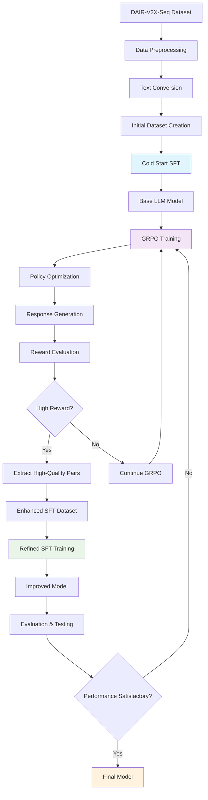

# AVDecisionLLM

🚗 **Autonomous Driving Decision System Powered by Large Language Models**

AVDecisionLLM is an innovative approach to autonomous vehicle decision-making that leverages the power of Large Language Models (LLMs) for complex driving scenarios. This project transforms Vehicle-to-Everything (V2X) sequential data into structured natural language representations, enabling LLMs to understand and reason about autonomous driving decisions through supervised fine-tuning and reinforcement learning techniques.

[](https://python.org)
[](https://github.com/huggingface/trl)
[](LICENSE)

 🎯 Overview

Traditional autonomous driving systems rely heavily on rule-based decision-making and classical machine learning approaches. AVDecisionLLM introduces a paradigm shift by:

- **Natural Language Processing**: Converting complex V2X sensor data into human-readable text descriptions
- **LLM-Based Reasoning**: Utilizing the contextual understanding capabilities of large language models
- **Multi-Modal Integration**: Combining spatial, temporal, and semantic information from autonomous vehicle scenarios
- **Reinforcement Learning**: Implementing GRPO (Group Relative Policy Optimization) for continuous improvement

## 📊 Dataset

 DAIR-V2X-Seq Dataset

Our training data is sourced from the **DAIR-V2X-Seq** dataset, a comprehensive collection of Vehicle-to-Everything (V2X) sequential data for autonomous driving research.

**Dataset Information:**
- **Source**: [AIR-THU/DAIR-V2X-Seq](https://github.com/AIR-THU/DAIR-V2X-Seq)
- **Type**: Cooperative perception dataset with vehicle-infrastructure cooperation
- **Features**: Multi-modal sensor data including LiDAR, cameras, and GPS
- **Scenarios**: Urban intersections, highway merging, complex traffic situations
- **Format**: Sequential time-series data with vehicle trajectories and environmental context

**Key Dataset Characteristics:**
- 🚦 **Urban Scenarios**: Complex intersection navigation with traffic lights
- 🛣️ **Highway Scenarios**: Merging, lane changing, and high-speed decision making  
- 🚗 **Multi-Vehicle Interactions**: Cooperative and competitive driving behaviors
- 📡 **V2X Communication**: Real-world vehicle-to-infrastructure communication data

## 🛠️ Technical Stack

### Core Framework: TRL (Transformer Reinforcement Learning)

Our implementation is built upon the **TRL** framework, which provides state-of-the-art tools for training language models with reinforcement learning.

**TRL Framework:**
- **Repository**: [huggingface/trl](https://github.com/huggingface/trl)
- **Documentation**: [TRL Documentation](https://huggingface.co/docs/trl/index)
- **Key Features**: 
  - PPO (Proximal Policy Optimization) implementation
  - GRPO (Group Relative Policy Optimization) support
  - Direct Preference Optimization (DPO)
  - Supervised Fine-Tuning utilities

**Additional Dependencies:**
- **Transformers**: For LLM model architecture and tokenization
- **Datasets**: For efficient data loading and preprocessing
- **Accelerate**: For distributed training and optimization
- **Wandb**: For experiment tracking and visualization

## 🔄 Training Pipeline

### Training Flow Diagram



 Detailed Training Process

 Phase 1: Cold Start Supervised Fine-Tuning (SFT)
1. **Data Preparation**: Convert V2X sequential data into natural language descriptions
2. **Initial Training**: Perform supervised fine-tuning on driving scenario descriptions
3. **Base Model Creation**: Establish foundational understanding of driving contexts

#### Phase 2: GRPO Reinforcement Learning
1. **Policy Initialization**: Use SFT model as initial policy
2. **Environment Setup**: Define reward functions based on driving safety and efficiency
3. **GRPO Training**: Implement Group Relative Policy Optimization
4. **Response Generation**: Generate driving decisions for various scenarios

#### Phase 3: Iterative Improvement
1. **Reward Evaluation**: Assess generated responses using safety and performance metrics
2. **High-Quality Extraction**: Select question-answer pairs with highest rewards
3. **Dataset Enhancement**: Augment training data with successful examples
4. **Refined SFT**: Perform additional supervised fine-tuning on enhanced dataset

## 🚀 Getting Started

### Installation

```bash
# Clone the repository
git clone https://github.com/your-username/AVDecisionLLM.git
cd AVDecisionLLM

# Install dependencies
pip install -r requirements.txt

# Install TRL framework
pip install trl transformers datasets accelerate wandb
```

### Quick Start

```python
from av_decision_llm import AVDecisionModel, DataProcessor

# Initialize data processor
processor = DataProcessor(dataset_path="path/to/dair-v2x-seq")

# Process V2X data to text
text_data = processor.convert_to_text()

# Initialize model
model = AVDecisionModel(
    base_model="microsoft/DialoGPT-medium",
    training_config="configs/sft_config.yaml"
)

# Start training pipeline
model.train_pipeline(
    sft_data=text_data,
    grpo_config="configs/grpo_config.yaml"
)
```

## 📈 Performance Metrics

Our evaluation framework includes:

- **Safety Metrics**: Collision avoidance, traffic rule compliance
- **Efficiency Metrics**: Travel time, fuel consumption optimization  
- **Comfort Metrics**: Smooth acceleration, minimal jerk
- **Adaptability**: Performance across diverse driving scenarios

## 🔬 Research Applications

AVDecisionLLM enables research in:

- **Explainable AI**: Natural language explanations for driving decisions
- **Multi-Agent Systems**: Cooperative vehicle behavior modeling
- **Transfer Learning**: Adaptation to new driving environments
- **Human-AI Interaction**: Natural communication between humans and autonomous systems

## 📚 Citation

If you use AVDecisionLLM in your research, please cite:

```bibtex
@misc{avdecisionllm2024,
  title={AVDecisionLLM: Autonomous Driving Decision System Powered by Large Language Models},
  author={Your Name},
  year={2024},
  howpublished={\url{https://github.com/your-username/AVDecisionLLM}}
}
```

## 🤝 Contributing

We welcome contributions! Please see our [Contributing Guidelines](CONTRIBUTING.md) for details.

## 📄 License

This project is licensed under the MIT License - see the [LICENSE](LICENSE) file for details.

## 🙏 Acknowledgments

- **DAIR-V2X-Seq Team** at AIR-THU for providing the comprehensive dataset
- **Hugging Face TRL Team** for the excellent reinforcement learning framework
- **Autonomous Driving Research Community** for continuous innovation and collaboration

## 📞 Contact

For questions and collaborations, please reach out:
- Email: your.email@university.edu
- GitHub Issues: [Open an Issue](https://github.com/your-username/AVDecisionLLM/issues)
- Project Page: [AVDecisionLLM](https://your-username.github.io/AVDecisionLLM)

---

*AVDecisionLLM: Bridging the gap between natural language understanding and autonomous driving intelligence.*
